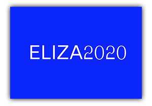

# ELIZA2020

### Welcome to a phycological help center created by Wikihow technology.

Due to the rapid change of the way of communications, the new generations seek education for human interaction. Eliza2020 is evolved from the one built in 1960's to sort out this situation.

Using *wikiHow* — an online wiki-style community consisting of an extensive database of how-to guides — ELIZA2020 is going to tell you how to handle your relationships and emotions even step by step.   

### Colophon

Design and development by [Soyun Park](http://soyunparrrk.com/) at Royal Academy of Art, The Hague with the guidance of [Martijn de Heer](http://www.martijndeheer.nl/) as part of Coding class.  
Typeface Phase is by [Elias Hanzer](https://www.eliashanzer.com).  

